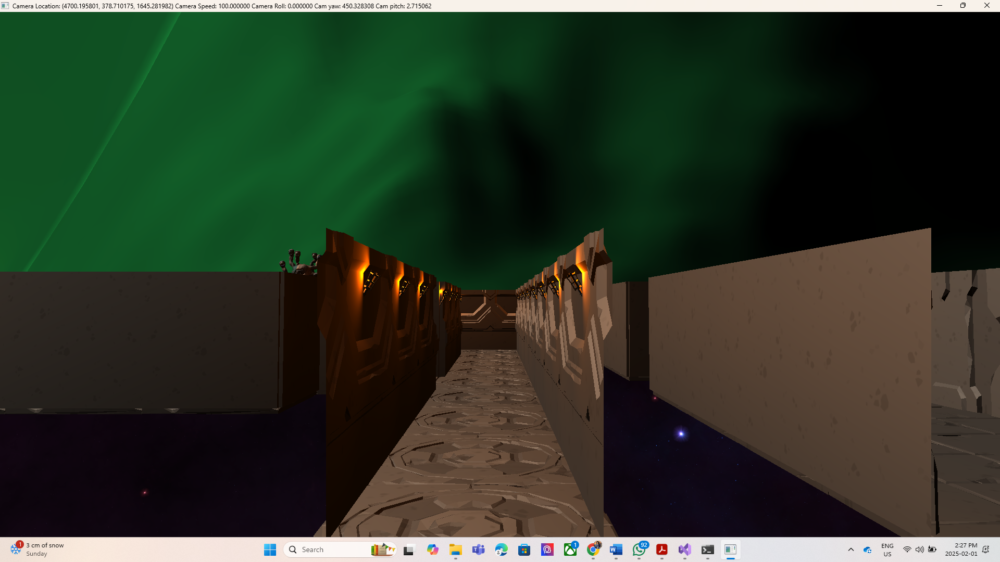

# OpenGL_Graphics_Project3
This is a graphics project coded totally in C++ using OpenGL, GLAD, GLFW and in my own custom game engine!

## CAM CONTROLS:
TAB + WASD for movement

TAB + SPACE go up

TAB + CTRL go down

TAB + Q or E roll

